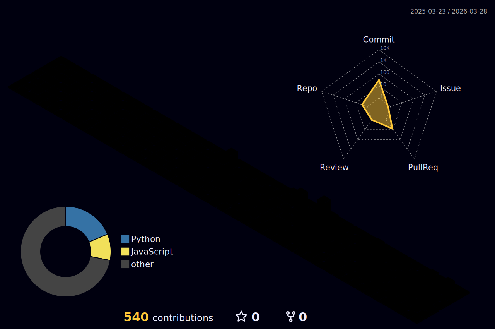

### Olá eu sou o Wellington Magri 🏅

Estou no 5° Semestre em Análise e Desenvolvimento de Sistemas na Universidade de Sorocaba - (UNISO).

#### Meu Linkedin 👇

  
 |  |  
 | ----------- | ----------- |

 
  

   

  

 
##
   

     
  

<picture>
  <source media="(prefers-color-scheme: dark)" srcset="https://raw.githubusercontent.com/platane/platane/output/github-contribution-grid-snake-dark.svg">
  <source media="(prefers-color-scheme: light)" srcset="https://raw.githubusercontent.com/platane/platane/output/github-contribution-grid-snake.svg">
  
</picture>

