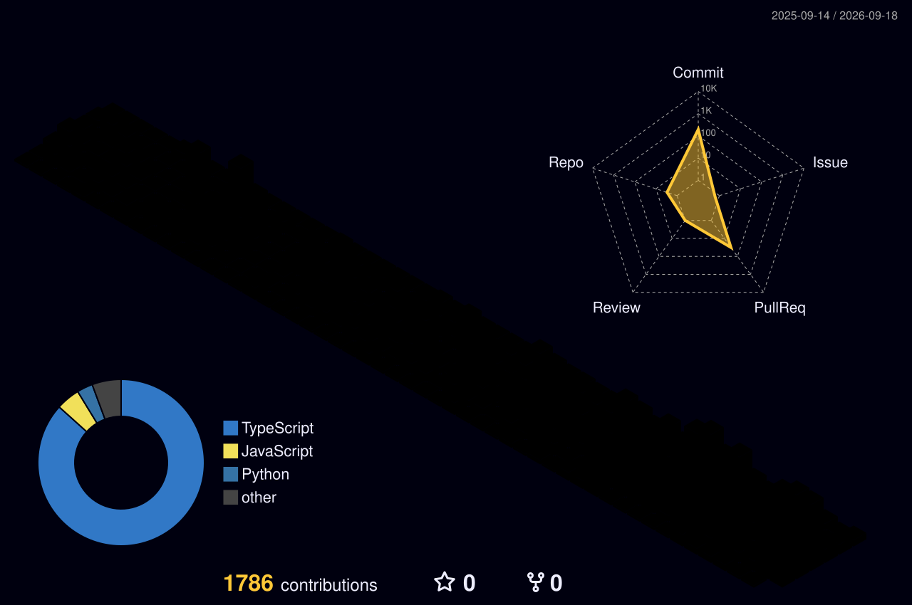

 

Apaixonado por desenvolvimento **Web e Mobile**, com foco em **soluções escaláveis, experiência do usuário** e boas práticas de código.  

---

## 👨‍💻 Sobre mim
- 🎓 Graduado em **Análise e Desenvolvimento de Sistemas**  
- 🚀 Atuando como **Desenvolvedor Júnior FullStack - T4EGROUP**  

---

## 🔗 Conecte-se comigo
  

✉️ wellington.filipe@t4egroup.com.br 

---

## 🚀 Projetos em Destaque
- [**Chatbot**](https://github.com/Tinhomagri/chatbot) → Plataforma de gestão de mensagens automáticas (**Python + twilio**)    
- [**Taskly**](https://github.com/Tinhomagri/Taskly) → Gerenciador de tarefas inteligente (**Python**)

## Atualmente:
 - **Atuando como Desenvolvedor Full Stack**
 - *Solucionando problemas de empresas.*
 - *Entregando Qualidade e Eficiência.*
 - *Aprendizado contínuo.*

---

## 📊 Estatísticas
  

 

---

## 🛠️ Tecnologias

  

---

  <table align="center">
  <tr>
    <td valign="top">
      

  

        

          
        

    </td>
    <td valign="top">
     

       
        

     
Ouçando Musga

    </td>
</table>

---

<picture>
  <source media="(prefers-color-scheme: dark)" srcset="https://raw.githubusercontent.com/platane/platane/output/github-contribution-grid-snake-dark.svg">
  <source media="(prefers-color-scheme: light)" srcset="https://raw.githubusercontent.com/platane/platane/output/github-contribution-grid-snake.svg">
  
</picture>

